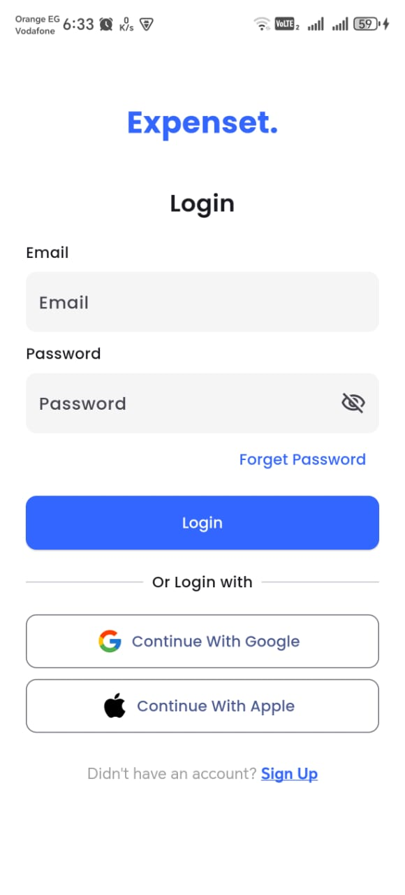
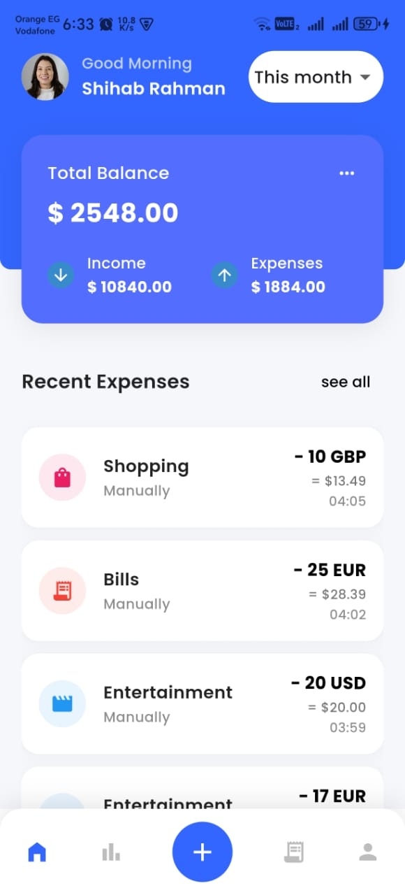
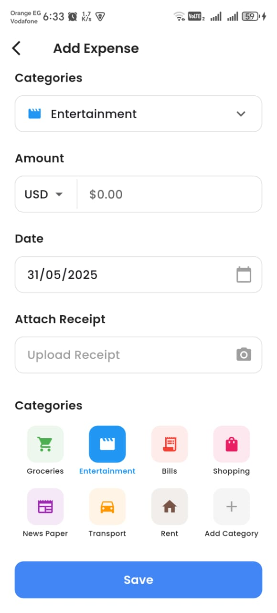

# Expense Tracker Lite

## Overview
This Flutter app is an Expense Tracker designed to help users manage and track their expenses with currency conversion features.

---

## Architecture and Structure

The project follows a **clean architecture** approach with separation of concerns across multiple layers:

- **Data Layer**: Handles API services, repositories, and local database helper.
- **Domain Layer** (Optional): Business logic and models.
- **Presentation Layer**: Flutter UI widgets and state management using Cubits (BLoC).

---

## State Management

- The app uses **Flutter Bloc** package with **Cubit** for managing state.
- Each feature has its own Cubit to handle business logic and state changes.
- Cubits expose states like loading, success, and error to update the UI reactively.

---

## API Integration

- API calls are handled using **Dio** package.
- The app uses a repository pattern to abstract API details from the UI.
- Currency conversion data is fetched from an external API and cached locally.

---

## Pagination Strategy

- Pagination is implemented locally by fetching and displaying expenses incrementally.
- The Cubit exposes a `hasMore` flag and `loadMoreExpenses()` method to load more data when the user scrolls.

---

## UI Screenshots


  



---

## Trade-offs and Assumptions

- For simplicity, offline persistence is limited to basic SQLite storage.
- Currency rates are refreshed only when the user adds a new expense.
- Pagination is done locally; no server-side pagination.
- The UI code could be improved and rewritten more and more.

---

## How to Run the Project

1. Clone the repository:
   ```bash
   git clone https://github.com/AbuElmagd97/expense_tracker_lite.git

2. Install dependencies:
   ```bash
   flutter pub get

3. Run app:
   ```bash
   flutter run

4. Login to the app using the following credentials:
   ```makefile
   Email:    test@example.com  
   Password: 123456

## Contributing
Contributions are welcome! If you have suggestions, feature requests, or bug reports, feel free to open an issue or submit a pull request.

## License
This project is licensed under the MIT License.

## Contact
For any questions or collaboration inquiries, feel free to reach out at mohamed.aboelmagd2021@gmail.com.
